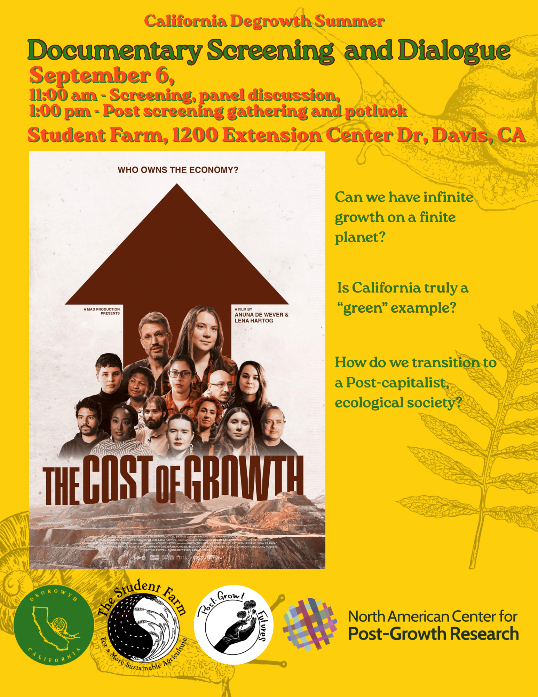
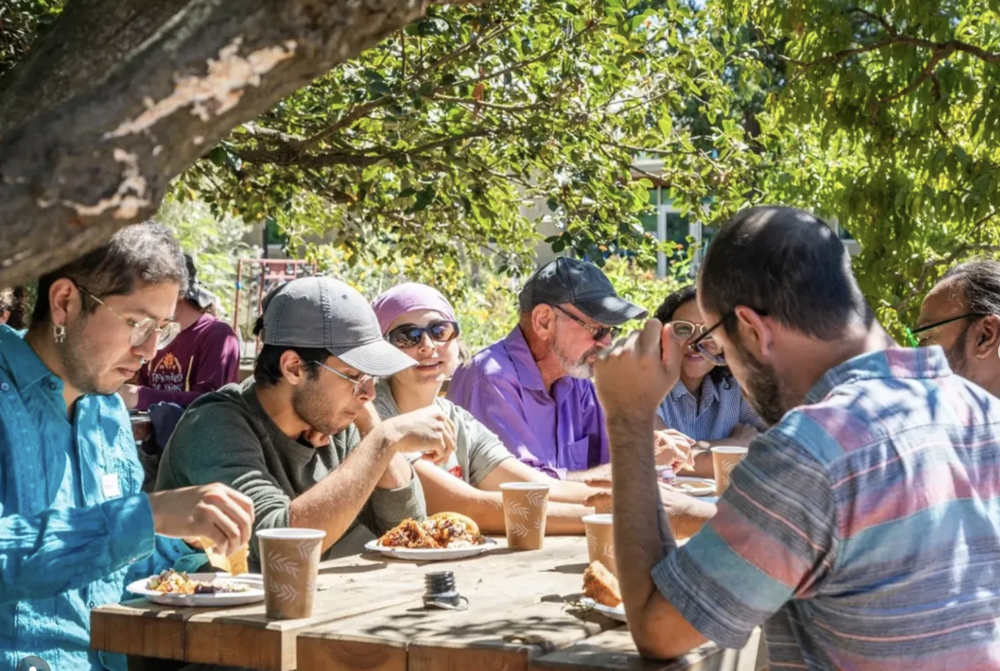
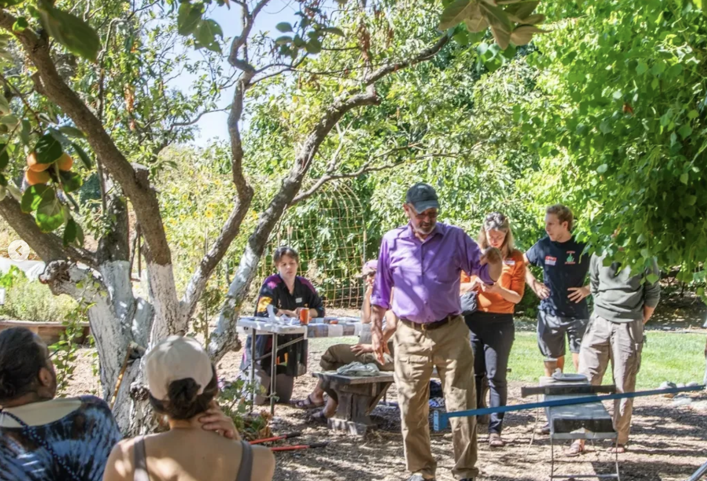

# Event description

“The cost of growth” is a film about how the struggles communities face against the extractive systems behind the global economy. After the screening, we hosted a potluck at the ecofarm with free food, art activities and music to keep the conversation about how does these themes relates to our community and beyond.

This event was part of a series organized in collaboration with [Degrowth California](https://www.degrowthcalifornia.org) and [The North American Center for Postgroth Research](https://postgrowthresearch.org)

{style="fig-align:center"}

# Photos of the event

{style="fig-align:center"}
{style="fig-align:center"}