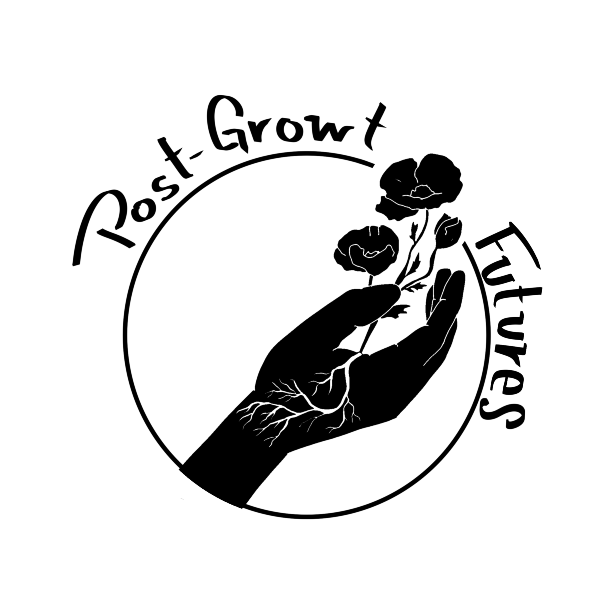

{style="fig-align=center"}

<!---
Through mutual aid, community organizing, and art, we re-imagine the future, or futures ...

A future where we have enough

A future where we don't need to fight for resources

A future where capital accumulation is not encouraged

A future where we share the gifts of nature and take care of the planet.

What happens when growth is not enough? What comes after?

Redistribution. There is enough for everyone.

--->